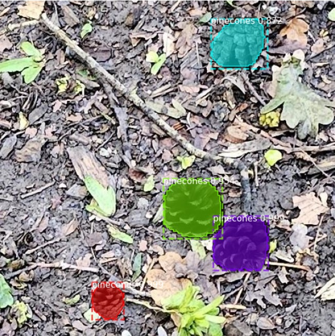
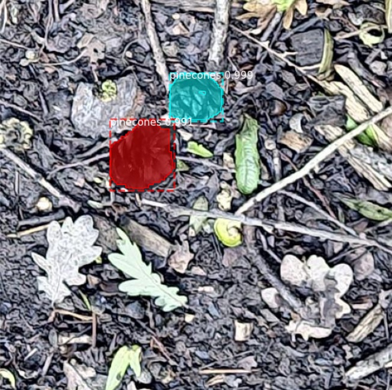

# Pinecones detection using synthetic data generated by cocosynth

This repository contains everything you need to create a synthetic COCO dataset from scratch and train a MaskRCNN model.

For COCO dataset creation I've utilised [cocosynth](https://github.com/akTwelve/cocosynth/tree/master)

For MaskRCNN [MaskRCNN-leekunhee](https://github.com/leekunhee/Mask_RCNN/tree/master)

The work is divided into two parts:

##1. COCO dataset creation:
Check out the [Getting Started with Cocosynth: Create synthetic data](https://github.com/akTwelve/cocosynth/blob/master/docs/getting-started.md).
This repository doesn't contain the dataset due to memory issues. But it can be regenerated following the steps mentioned.
- I took several images of pinecones and removed their backgrounds using CVAT. Each pinecone image is in .png format with transparent background.
- Also, took some background photos without the pinecones.
- "image_composition.py" creates images of pinecones overlayed on top of 512x512 size cropped background images, randomly, along with their masks.
- "coco_json_utils.py" then converts these to COCO instances in .json.

##2. Training MaskRCNN:
Biggest challenge faced here was to get the right compatibilities for python, tensorflow, keras, cudatoolkit, cudnn working with 3060Ti GPU.

My Combo that Worked - RTX 3060 Ti
Python 3.8
CUDA Toolkit 11.1.1
CUDNN 8.0.5.39
tensorflow 2.4
keras 2.4.3

Once you have that sorted, run ["train_mask_rcnn.ipynb"](https://github.com/akTwelve/cocosynth/blob/master/notebooks/train_mask_rcnn.ipynb)

 
